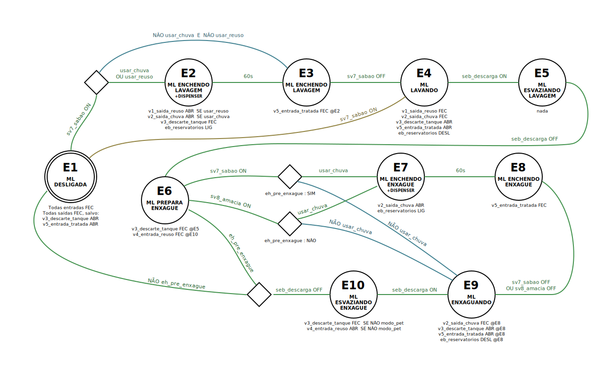

# Malajo

Malajo é um projeto de hardware/software para reuso de água de forma ecoeficiente em máquinas de lavar roupas.

_Malajo_ é uma pseudo-sigla para _Máquina de Lavar Roupas Ecoeficiente do Jovim_.

## Descrição

A proposta do Malajo é integrar ao processo de lavagem dois tanques de água: (1) água de chuva tratada e (2) água de reuso dos enxágues.

Usando um arduino para acompanhar o processo da máquina de lavar, controla-se um sistema de válvulas e eletrobomba que redirecionam as entradas e saídas de água para melhor aproveitamento:

Diagrama dos estados e ações dos processos de lavagem:

O código do arduino pode ser encontrado em [malajo.ino].
A figura abaixo ilustra o equema do circuito.

Para detalhes e simulação, consulte o projeto [disponível no Tinkercad]().

## Uso

TODO: Documentar.

## Informações Adicionais

### Fluxograma do Processo

TODO: Documentar.

### Consumo de Água

TODO: Documentar.

## Particularidades e Problemas Comuns

### Válvulas Solenoides

Válvulas solenóides convencionais para projetos arduino não costumam dar conta da vazão necessária.
Neste projeto foram utilizados servomotores acomplados à registros de água convencionais.

Os servomotores utilizados são do tipo _rotacional_ (o que tinha disponível), requerendo diversas adaptações no programa para cumprir tempos de acionamento e registro de estado aberto/fechado.
Considera-se em futuras versões utilizar servos tipo _posicional_ e revisar o programa.

### Pinos 0 e 1 do Arduino

Estes pinos são usados para comunicação serial e podem interferir até mesmo na programação via USB ([ref.](https://www.arduino.cc/reference/en/language/functions/communication/serial/)).

Ao transferir o programa para o arduino, prefira desconectar quaisquer fios destes pinos.

Tenha cuidado ao rearranjar as conexões dos pinos do arduino. O pino 0 em especial é bastante problemático se usado como entrada digital ([ref.1](https://forum.arduino.cc/t/using-digital-pin-0-and-1-just-like-any-other-digital-pin/462591), [ref.2](https://forum.arduino.cc/t/pins-0-and-1-for-led/551369)).

### Referências

* TODO: Manual da Máquina de Lavar XXXX

## Alerta

Para fazer uso deste material você deve concordar com a [licença de uso](./LICENSE).
Intervenções elétricas podem causar danos e perdas (inclusive da garantia do seu equipamento), considere supervisão profissional.

Este projeto de hardware/software é incipiente, baseado unicamente no equipamento disponível na execução do protótipo.
As informações podem estar equivocadas ou incompletas, não há qualquer garantia ou responsabilidade sobre elas.
